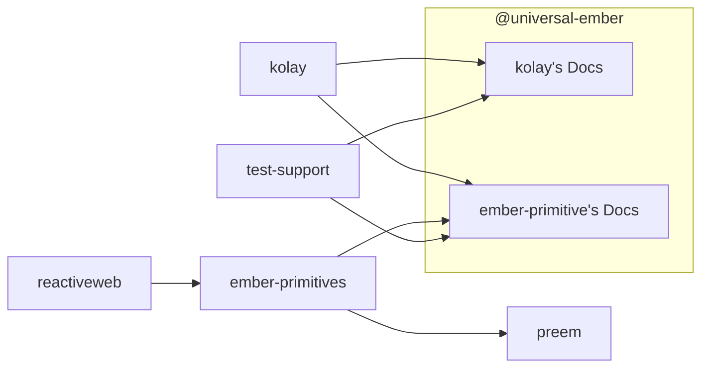
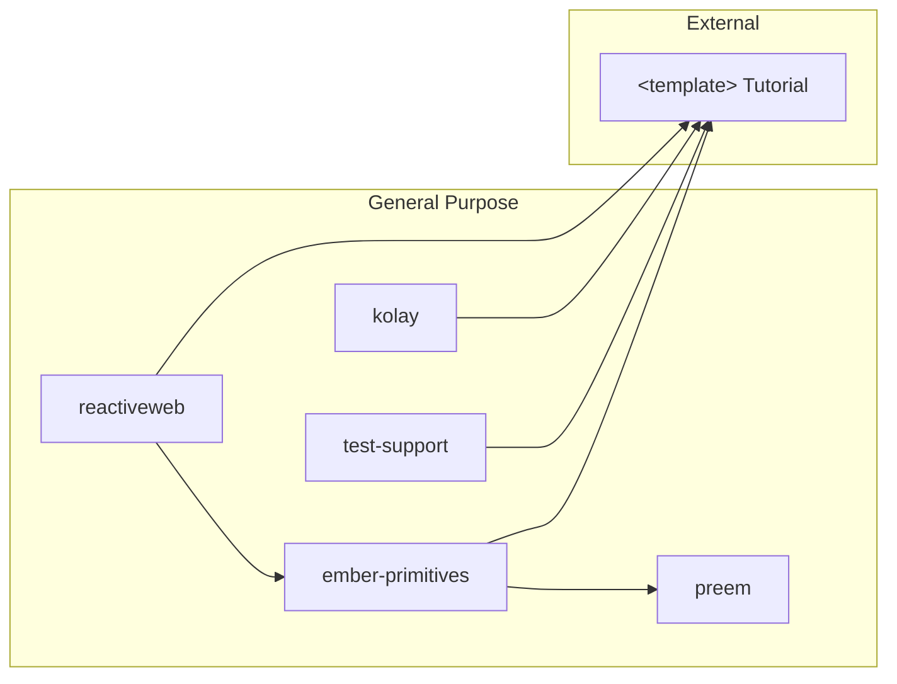

# Universal Ember

**Building the primitives T H E &nbsp;  P L A T F O R M _should have had_ the whole time**.

A common thought within companies about headless libraries, or "generic libraries" _at all, is that there is a fear of choosing a library, and over time, that library becoming abandoned. This has happened all over open source, and can be a motivator for folks _shying away_ from open source, and re-implementing everything themselves. 

To help alleviate this fear, the _Universal Ember_ org has been created to help share ownership of libraries, to improve the bus factor beyond 1 person, or 1 company.

If you have a project that you'd like to share the maintenance burden of, message me in the [Ember Discord](https://discord.com/invite/emberjs) `@NullVoxPopuli`, and we can help improve the busfactor, and help companies feel reassured in the decision to use a library under this org.

## Tech

All libraries within this org conform to these goals:
- [SemVer](https://semver.org/) and [SemVer TS](https://www.semver-ts.org/) Compliant -- upgrade without surprises
- Native npm packages (or v2 addons) -- allowing the addons to contain any number of components without cost to those who don't use every component (tree shakeable)
- Fully [glint](https://typed-ember.gitbook.io/glint) compatible -- typed templates are the future, guiding folks to passing correct arguments and using the correct yields from a component
- gjs/gts first -- when building components this way, components tend to be smaller, lighter, and easier to work with. from the consumer side of things, this means easy imports without lots of paths to manage
- Derived Data focused -- whenever possible, components rely on derived data to manage state. No extra renders triggered by ember's equivelent(s) of `useEffect`.
- Builds on the latest platform features -- no one _wants_ to maintain code, so when browsers ship something that make something easier, these libraries adopt it.

## What exists elsewhere?

These projects meet the above tech goals

_Bring your own styles for..._
- [Form](https://ember-headless-form.pages.dev/)
- [Table](https://ember-headless-table.pages.dev/)

## Related projects

These projects have similar design goals in augmenting The Platform, but may not have the same goals. Still good projects, but different goals.

- [headless-ui](https://github.com/GavinJoyce/ember-headlessui/)

## What belongs here?

Any library that provides UI abstractions without styling.
These sorts of libraries cover many concerns that _T H E   P L A T F O R M_ has known were issues, but have not solved for us.

Capabilities can include:
 - common behaviors
 - common UI patterns (select, dropdown, tables, etc)
 - correctly ensuring that a screen reader works appropriately for all possible text (even dynamic)
 - and more!
 
The goal is to aggregate and build an SDK of libraries that we all wish the web provided for us.
We bring our own styles and additional use-case-specific behaviors on top of those libraries.

## Packages 

## Relation to external projects

All of the projects in `@universal-ember` can be used outside of this organization.

## How does this org relates to [Adopted Ember Addons](https://github.com/adopted-ember-addons)

This org has the same philosophy, maintenance strategy, and contribution model as Adopted Ember Addons and is not meant to be a competitor.
The difference is that this org is focused on UI primitives that can help build out design systems.
This org will/does likely consume addons from Adopted Ember Addons, as there is a lot of really good stuff over there.
Additionally, as time goes on, libraries from Universal Ember may be transferred to Adopted Ember Addons.

